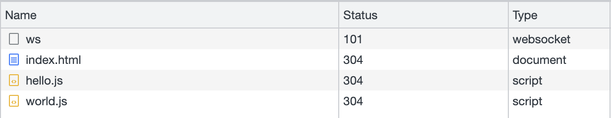
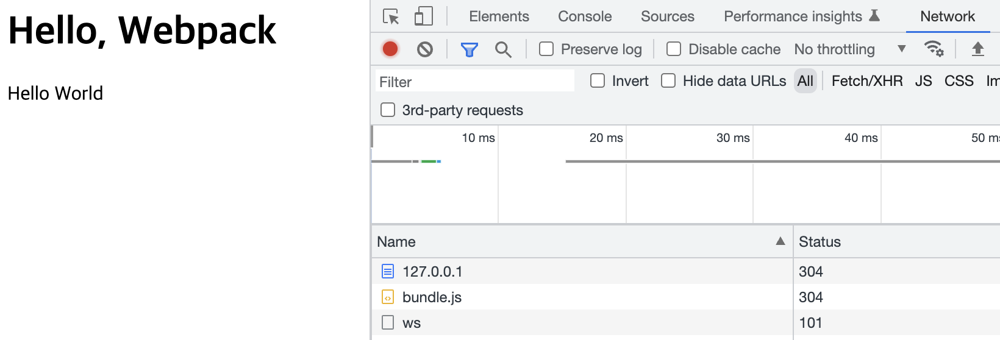
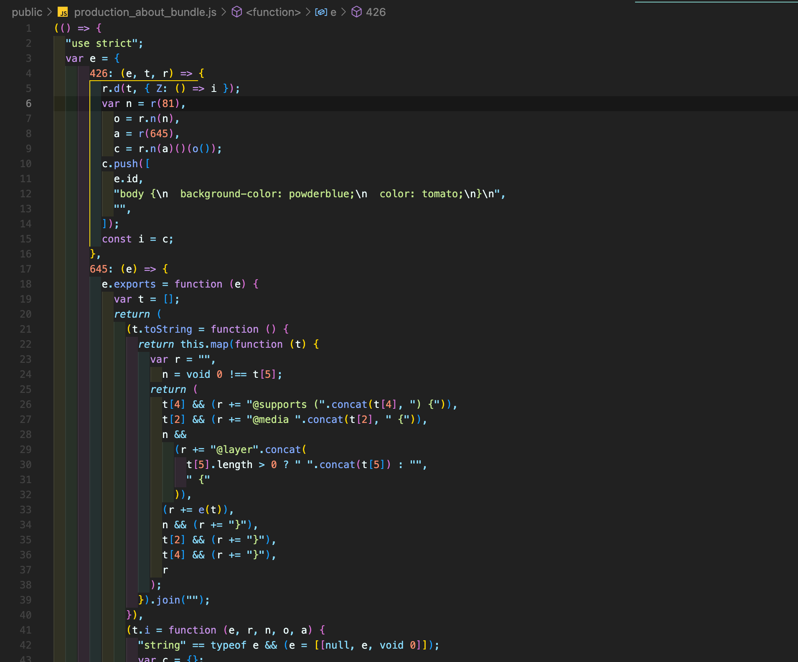
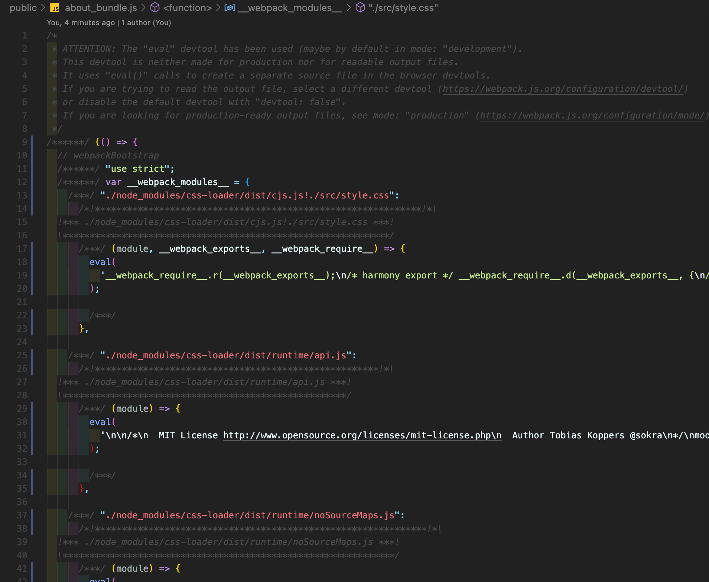
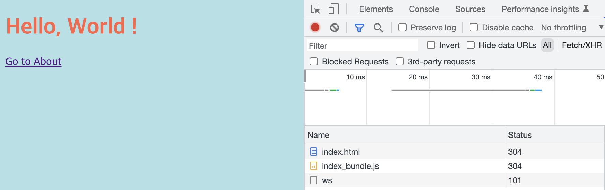
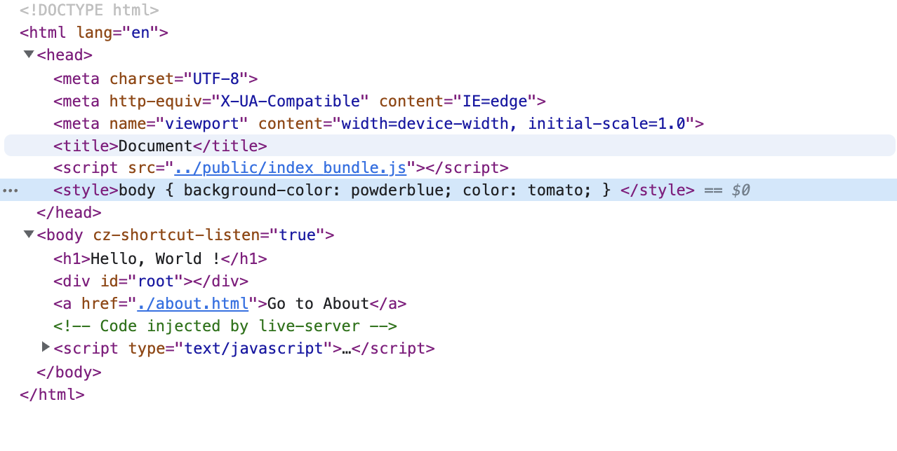
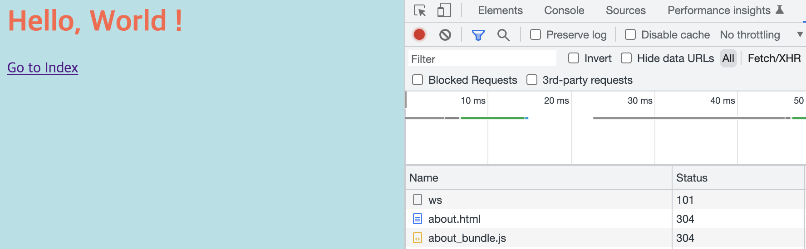

이 글은 이고잉님의 [생활코딩 Webpack 편](https://opentutorials.org/module/4566)을 기반으로 학습한 내용입니다.


# 들어가기에 앞서

여러 채용 공고와 기술 서적에서 webpack의 존재를 확인한 적이 있다. 하지만 webpack이 고갤 들어 나에게 인사를 건낼 때 마다 지금껏 이 꽉 깨물고 모른 척 해왔다. 그 이유는 두 가지 정도로 압축할 수 있겠는데, 첫째는 “이거 지금 내가 할 수 있을까? 아냐 못 할거야”라는 지레 짐작, 둘째는 “React에서 CRA하면 알아서 되는데 지금 굳이..?” 정도였다.

하지만 요즘들어 조금씩 단순 기능 구현보다는 내부 구현 사항들이 궁금해진다. 가령 브라우저 렌더링 과정에서 단순 문자의 나열인 html, css 문서를 토큰 - 노드 - DOM(CSSOM)으로 파싱하는 과정의 내부에서는 대체 어떤 일이 일어나고 있는 걸까? 라던지, React의 Vitual DOM이라는 아이는 비교 알고리즘을 통해 실제 DOM에서 변경된 사항만 쏙 바꿔준다는데 그 알고리즘은 대체 어떻게 구현되어 있는걸까? 같은.

그러다가 우연히 webpack을 다시 한번 마주쳤다. 그땐 이런 생각이 들었다. “얘부터 꿀밤 정도는 때려봐야 나의 다른 궁금증들을 하나 둘씩 해소할 수 있겠구나". 그래서 학습해보았다. webpack이란 아이는 대체 어떤 이유로 탄생했으며, 어떤 문제점을 해결해주는지. 그리고 앞으로 webpack을 직접 설정하거나 수정해야할 때에는 어떻게 접근해야할지.

# Webpack

Webpack은 번들러다. 어원 그대로 묶는 도구정도로 해석할 수 있다. 그럼 ‘무엇을’ 묶을까? 그리고 ‘왜’ 묶을까? 답은 JavaScript의 변수 유효 범위에 있다. JavaScript의 변수는 기본적으로 전역 범위를 가진다. 이를 기억하고 아래의 코드를 보자, 어떤 결과물을 기대할 수 있을까?

```html
<!-- index.html -->
<html>
  <head>
    <script src="./src/index.js"></script>
    <script src="./src/hello.js"></script>
  </head>
  <body>
    <h1>Hello, Webpack</h1>
    <div id="root"></div>
    <script>
      document.querySelector("#root").textContent = word
    </script>
  </body>
</html>
```

```js
// hello.js
let word = "Hello"

// index.js
let word = "World"
```

의도한 결과물은 Hello World 였지만 실제 결과는 World만 나왔다. script 태그로 불러온 두 JavaScript 파일의 변수명이 word로 겹치기 때문이다.



웹에서 동작하는 서비스의 규모가 점점 커지면서 이 변수명 중복 문제를 해결하기 위한 여러 테크닉이 발전했다. 하지만 여전히 근본적인 문제 해결은 불가능했다. 이고잉님의 표현을 빌리자면, 마치 폴더 기능이 없는 파일 시스템과 비슷하다. 그래서 나온 개념이 바로 모듈이다. 최신 브라우저에는 기본적으로 [모듈 기능이 탑재](https://ko.javascript.info/modules-intro)되어 있기도 하다.

해결되지 않는 문제는 한 가지가 더 있었다. 프로젝트의 크기가 커질수록 웹 서버에서 너무 많은 리소스를 다운로드를 해야했기 때문이다. 네트워크 커넥션이 너무 많아지면 비용 측면, 유저 측면 등 여러 요소에서 비효율이 발생했다. 그렇게 ‘웹에서도 모듈의 개념을 사용하고 싶다는 의견’과 ‘리소스의 네트워크 커넥션 문제’로 등장한 것이 바로 Webpack이다.

최근 번들러 춘추 전국시대라는 말이 나올 정도로 여러 번들링 툴이 등장하고 있다. Rollup 이라는 번들러도 Webpack과 함께 꾸준히 인기가 많고, [2021년 기준으로는 Vite, esbuild, SWC가 가장 많이 사랑받고 있기도 하다](https://2021.stateofjs.com/en-US/libraries/build-tools). 그럼에도 Webpack으로 학습해보는 이유는 여전히 레거시 코드에는 Webpack으로 번들링된 코드가 많고 생태계가 가장 넓기 때문도 있지만, 오랫동안 사랑받은 번들러를 이해함으로써 Vite등의 최신 번들러가 10~100배의 속도 차이를 낼 수 있는 이유도 명확히 파악이 가능하다고 생각하기 때문이다.

자, 서론이 길었다. 그럼 그 Webpack이 어떻게 자유분방하던 친구들을 한곳에 모아주는지 살펴보자.

# Webpack basic

Webpack이 없을 때, 브라우저의 모듈을 적용했을 때, Webpack을 기본 적용했을 때 세 가지를 비교해보자.

## Webpack이 없을 때

Webpack을 적용하지 않았을 때의 코드를 실행했을 때에 Network 탭을 살펴보자. 아래와 같이 hello.js 파일과 world.js 파일이 각각 다운로드 된다. 또한 각 파일이 변수명이 겹치면서 원하는 출력을 하지 않는다


## 모듈화 하기

최신 브라우저에서는 script 태그의 type에 module을 지원한다. 몇가지 설정은 다음과 같다. 모듈화에 대한 자세한 내용은 [링크](https://ko.javascript.info/modules-intro)를 참고하자.

- script 태그에 type=”module”
- script 태그 내부에서 원하는 모듈 import
- 해당 js 파일에서 export

```html
<!-- index.html -->
<html>
  <body>
    <h1>Hello, Webpack</h1>
    <div id="root"></div>
    <script type="module">
      import helloWord from "./src/hello.js"
      import worldWord from "./src/world.js"
      document.querySelector("#root").textContent = helloWord + " " + worldWord
    </script>
  </body>
</html>
```

```js
// hello.js
let word = "Hello"
export default word
```

```js
// world.js
let word = "World"
export default word
```

이렇게 모듈화를 하면 변수명 중복 문제가 해결된다. 하지만 Network 탭에서는 여전히 문제가 남아있다. 모든 js 파일을 다운로드 하고있다.


## Webpack basic

Webpack의 설치는 되었다고 가정하고 Webpack 명령어를 통해 원하는 파일을 번들링 해보자.

목표는 hello.js와 world.js를 import한 index.js를 entry 파일로 지정하고 해당 js파일을 번들링한 js파일을 원하는 위치에 저장시키는 것이다. index.html에서는 해당 번들링 파일 !딱 하나만! 가져와도 원하는 동작을 해야한다.

```html
<!--  index.html -->
<html>
  <body>
    <h1>Hello, Webpack</h1>
    <div id="root"></div>
    <script src="./public/bundle.js"/></script>
  </body>
</html>
```

```js
// index.js
import helloWord from "./hello.js"
import worldWord from "./world.js"

document.querySelector("#root").textContent = helloWord + " " + worldWord
```

```js
npx webpack --entry ./src/index.js --output-path ./public --output-filename bundle.js
```

이제 터미널에서 webpack을 실행해보자.

- —entry
  번들링할 파일
- —output-path
  번들링 파일을 지정할 파일 위치
- —output-filename
  저장할 번들링 파일의 이름

참고로 entry와 output을 지정하지않고 명령어 npx webpack 만 실행했을 때 기본 설정은 아래와 같다.

- entry : ./src/index.js
- output : ./dist/main.js

번들링 후 실행했을 때 화면이다.

의도한 “Hello World”가 정상적으로 출력되고, Network 탭에서는 bundle.js 파일 단 하나만 다운로드 하는 것을 확인할 수 있다. 이제 수백개의 JavaScript를 단 하나의 파일만 다운로드를 해서 실행할 수 있다.



# webpack.config.js

매번 명령어를 나열하면서 실행하기엔 비효율적이다. 그렇기 때문에 root위치에 설정 파일을 만들어서 원하는 설정을 자동 지정하도록 처리할 수 있다.

상단에서 사용한 webpack 명령어를 webpack.config.js에서 처리하면 다음과 같다. 이제 npx webpack 명령어만 입력하면 된다.

```js
module.exports = {
  entry: "./src/index.js",
  output: {
    path: path.resolve(__dirname, "public"),
    filename: "bundle.js",
  },
}
```

# 모드의 도입

Webpack에는 개발모드와 프로덕트모드가 있다. 우선 두 모드의 차이를 코드로 살펴보자.

_production mode_


_development mode_


위 코드가 프로덕트 모드, 아래가 개발 모드이다. 한 눈에 봐도 프로덕트 모드는 용량 압축을 위해 최대한 코드를 줄여 알아보기가 힘들다(물론 개발 모드가 쉽다는 말은 아니다 🙃) 각각의 모드마다 개발 모드는 개발자가 웹팩 로그나 결과물을 개발자가 파악하기 용이하고, 프로덕트 모드는 성능 최적화를 위한 파일 압축 등의 빌드 과정이 추가된다.

## 모드의 구분

모드를 구분하는 방식은 두 가지 정도로 정리 가능하다.

### 파일 분리

첫번째는 config 파일을 따로 구성하는 것이다. 아래 예시와 같이 각각의 파일 이름을 따로 구성할 수 있으며, 기본 명령어는 webpack.config.js 파일만 번들링하므로 프로덕션 모드를 번들링하려면 —config flag를 이용해 webpack.config.prod.js를 따로 지정해주어야 한다.

```js
// webpack.config.js
module.exports = {
  mode: "development",
  entry: "./src/index.js",
  output: {
    path: path.resolve(__dirname, "public"),
    filename: "bundle.js",
  },
}
```

```js
// webpack.config.prod.js
module.exports = {
  mode: "development",
  entry: "./src/index.js",
  output: {
    path: path.resolve(__dirname, "public"),
    filename: "bundle.js",
  },
}
```

### 환경변수

환경변수의 조건문으로 구분할수도 있다. 환경변수와 package.json scripts를 조합해서 단축한 명령어로 자동 처리를 할 수 있다. 환경변수처리를 위한 몇가지 조건은 아래와 같다.

- 객체였던 module.export를 함수로 변경하고 env MODE를 인자로 받는다.
- 인자의 모드에 따라 번들링 파일을 저장할 위치는 지정한다.
- 저장 위치뿐만 아니라 entry 파일이나 앞으로 나올 loader도 따로 지정해줄 수 있다.

```js
// webpack.config.env.js
module.exports = ({ MODE }) => {
  let outputFileName =
    MODE === "production"
      ? "production_[name]_bundle.js"
      : "development_[name]_bundle.js"

  return {
    entry: {
      index: "./src/index.js",
    },
    output: {
      path: path.resolve(__dirname, "dist"),
      filename: outputFileName,
    },
    // ...
  }
}
```

```json
"scripts": {
    "development": "npx webpack --config webpack.config.env.js --env MODE=production",
    "production": "npx webpack --config webpack.config.env.js --env MODE=production"
  },
```

# Loader

여전히 해결할 수 있는 몇 가지 문제가 남아있다. 그 중 Loader는 js파일 뿐만 아니라 css, image, url 등을 번들링할 수 있게 지원한다. 그래서 Loader를 Webpack의 꽃이라고 부르기도 한다.

Webpack 공식 문서에는 여러가지 Loader를 소개한다. 이 글에서는 예시로 css 파일을 Loader를 이용해 번들링 해보고자 한다.

css의 경우 css-loader, style-loader를 통해 config file에서 css 파일을 함께 번들링 할 수 있다.

```js
module.exports = {
  mode: "development",
  entry: "./src/index.js",
  output: {
    path: path.resolve(__dirname, "public"),
    filename: "bundle.js",
  },
  //loader
  module: {
    rules: [
      {
        //.css파일을 찾는 정규표현식
        test: /\.css$/,
        //css-loader를 통해 번들링하고, style-loader를 통해 적용한다
        //뒤에서부터 실행
        use: ["style-loader", "css-loader"],
      },
    ],
  },
}
```

Loader를 사용해서 CSS 파일을 함께 번들링 했다. 이제 Network 탭에서는 index_bundle.js만 불러와도 CSS가 적용된 것을 볼 수 있다.



Element 탭을 보자. head의 style에 원하는 CSS 설정이 JavaScript에 의해 삽입된 것을 볼 수 있다. 이제 JavaScript 파일 뿐만 아니라 무수히 많은 다른 파일들을 Loader를 이용해 함께 번들링 할 수 있게 되었다.



## Output 설정

상황에 따라 Output을 자유롭게 설정할 수도 있다. 예시를 위해 가정하는 상황은 index.js 파일 뿐만 아니라 about.js 파일을 번들링하고, 해당 번들링 파일을 원하는 폴더의 각자 다른 파일 이름으로 저장하는 것이다. 아래 config 코드에서 살펴보자.

```js
module.exports = {
  //...
  entry: {
    index: "./src/index.js", //
    about: "./src/about.js",
  },
  output: {
    path: path.resolve(__dirname, "public"),
    filename: "[name]_bundle.js",
  },
  //...
}
```

entry를 객체형태로 만들 수 있다. 번들링을 원하는 파일을 기입하고, output에서 파일 이름을 동적으로 할당할 수 있다. 저기서 [name]은 entry에서 설정한 객체 요소의 이름으로 들어가게 된다. 이제 원하는 output 설정을 할 수 있게 되었다. 더 자세한 설정은 [공식문서 output 탭](https://webpack.js.org/configuration/output/)에서 확인할 수 있다.

_index_bundle.js_


_about_bundle.js_


## Plugin 도입

Webpack에는 다양한 방식으로 빌드 프로세스를 사용할 수 있도록 여러 Plugin을 지원한다. Loader보다 훨씬 다양한 Plugin이 존재하고, 상황에 따라 원하는 결과에 따라 여러 Plugin을 조합, 활용이 가능하다.

모종의 이유로 HTML 파일을 번들링 파일과 동일한 위치에 만들어야 하는 상황이 생겼다고 가정하자. 이 경우에는 html-webpack-plugin 이라는 Plugin을 도입해서 문제를 해결할 수 있다. 번들링된 JavaScript를 자동으로 HTML에 추가해서 목적 폴더인 public 폴더에 생성해줄 것이다. 아래 코드를 살펴보자.

```js
const path = require("path")
const HtmlWebpackPlugin = require("html-webpack-plugin")

module.exports = {
  mode: "development",
  entry: {
    index: "./src/index.js", //
    about: "./src/about.js",
  },
  output: {
    path: path.resolve(__dirname, "public"),
    filename: "[name]_bundle.js",
  },
  module: {
    rules: [
      {
        test: /\.css$/,
        use: ["style-loader", "css-loader"],
      },
    ],
  },
  plugins: [
    new HtmlWebpackPlugin({
      template: "./src/index.html",
      filename: "./index.html",
      chunks: ["index"],
    }),
    new HtmlWebpackPlugin({
      template: "./src/about.html",
      filename: "./about.html",
      chunks: ["about"],
    }),
  ],
}
```

- template은 번들링할 HTML 파일을 말한다.
- filename은 말 그대로 생성할 파일 이름이다.
- chunks는 해당 HTML 파일에서 불러올 entry에 해당하는 JavaScript 파일을 지정하는 것이다. 현 상황에서 chunks가 없다면 HTML 파일에는 index.js와 about.js 두 JavaScript 파일을 둘 다 불러올 것이다.

이제 public 폴더에는 JavaScript 파일 뿐만 아니라 두 가지 HTML 파일이 생겼다. 또한 해당 폴더에서는 원하는 JavaScript 파일을 가져오고 있다.

```js
// public/index.js
<!DOCTYPE html>
<html lang="en">
  <head>
    <meta charset="UTF-8" />
    <meta http-equiv="X-UA-Compatible" content="IE=edge" />
    <meta name="viewport" content="width=device-width, initial-scale=1.0" />
    <title>Document</title>
    <script defer src="index_bundle.js"></script>
  </head>
  <body>
    <h1>Hello, World !</h1>
    <div id="root"></div>
    <a href="./about.html">Go to About</a>
  </body>
</html>
```

```js
// public/about.js
<html lang="en">
  <head>
    <script defer src="about_bundle.js"></script>
  </head>
  <body>
    <h1>Hello, World !</h1>
    <div id="root"></div>
    <a href="./index.html">Go to Index</a>
  </body>
</html>
```

# 마치며

이 밖에도 Webpack에는 live reload와 hot module replacement를 지원하는 DevServer, 너무 커진 번들링 파일을 쪼개고 필요할 때마다 로딩할 수 있는 Code splitting, Lazy loading 등 다양한 기능을 지원하고 있다. 이 기능들도 필요할 때 적절히 이해하고 적용해야 한다.

실제 상황에서는 위 예제들보다 훨씬 복잡하고 다양한 상황을 맞이해야할 것을 알고 있다. 그럼에도 오랫동안 사랑받은 기술의 존재의 의미와 기본적인 동작 방식을 이해하는 것은 응용에 앞서 좀 더 큰 숲의 관점에서 프로세스를 이해할 수 있다는 의미가 있는 것 같다. 너무 어려워보였던 기술을 막상 며칠 간 펼쳐놓고 보니 그리 무서운 것은 아니었다. 앞으로도 이 경험을 토대로 필요에 의해 원하는 것들을 그냥 해보자. 생각보다 어려운 것은 없다!

### 참고자료

- [https://opentutorials.org/module/4566](https://opentutorials.org/module/4566)
- [https://joshua1988.github.io/webpack-guide/](https://joshua1988.github.io/webpack-guide/)
- [https://webpack.js.org/](https://webpack.js.org/)
- [https://2021.stateofjs.com/en-US/libraries/build-tools](https://2021.stateofjs.com/en-US/libraries/build-tools)
- [https://ko.javascript.info/modules-intro](https://ko.javascript.info/modules-intro)
